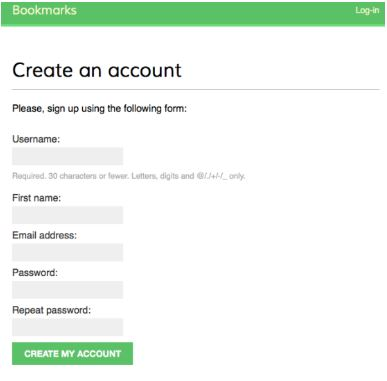
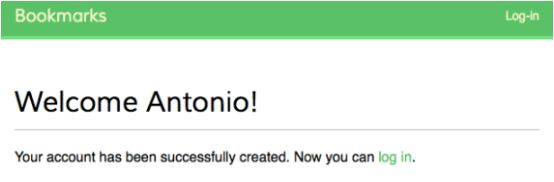

# Membuat Registrasi untuk User

Edit file `account/forms.py` dan tambahkan kode berikut ini ke dalamnya:

```python
from django.contrib.auth.models import User


class UserRegistrationForm(forms.ModelForm):
    password = forms.CharField(label='Password',
                               widget=forms.PasswordInput)
    password2 = forms.CharField(label='Repeat Password',
                                widget=forms.PasswordInput)
                                
    class Meta:
        model = User
        fields = ('username', 'first_name', 'email')

    def clean_password2(self):
        cd = self.cleaned_data
        if cd['password'] != cd['password2']:
        	raise forms.ValidationError('Passwords don\'t match.')
        return cd['password2']
```

Edit file `account/views.py` dan tambahkan kode berikut ke dalamnya:

```python
from .forms import LoginForm, UserRegistrationForm


def register(request):
    if request.method == 'POST':
        user_form = UserRegistrationForm(request.POST)
        if user_form.is_valid():
            # Create a new user object but avoid saving it yet
            new_user = user_form.save(commit=False)
            # Set the chosen password
            new_user.set_password(
                user_form.cleaned_data['password'])
            # Save the User object
            new_user.save()
            return render(request, 
                          'account/register_done.html',
                          {'new_user': new_user})
    else:
        user_form = UserRegistrationForm()

    return render(request,
                  'account/register.html',
                  {'user_form': user_form})
```

Sekarang, edit file `account/urls.py` dan tambahkan pola URL berikut ini:

```python
url(r'^register/$', views.register, name='register'),
```

Terakhir, buat file template baru di dalam direktori `account/templates/account` dengan nama `register.html` dan buat file tersebut terlihat seperti ini:

```html


Create an account


<h1>Create an account</h1>
<p>Please, sign up using the following form:</p>
<form action="." method="post">
    {{ user_form.as_p }}
    
    <p><input type="submit" name="Create my account"></p>
</form>

```

Tambahkan file template di dalam direktori yang sama dengan nama `register_done.html`. Tambahkan kode berikut ini ke dalamnya:

```html


Welcome


<h1>Welcome {{ new_user.first_name }}</h1>
<p>
    Your account has been successfully created.
    Now you can <a href="">Log in</a>
</p>

```

Sekarang, buka `http://127.0.0.1:8000/account/register/` di browser Kamu. Kamu akan melihat halaman registrasi yang Kamu buat seperti ini:



Isi data user baru dan klik tombol `Create my account`. Jika semua field valid, user akan dibuat dan Kamu akan mendapatkan pesan sukses seperti berikut:



Klik link log in dan masukan username dan password untuk memverifikasi apakah akun kamu sudah bisa diakses.

Sekarang, Edit file template `account/templates/registration/login.html` dan timpa baris ini:

```html
<p>Please, use the following from to log-in:</p>
```

Dengan kode ini:

```html
<p>
    Please, use the following form to log-in, 
    If you don't have an account 
    <a href="">register here</a>
</p>
```


