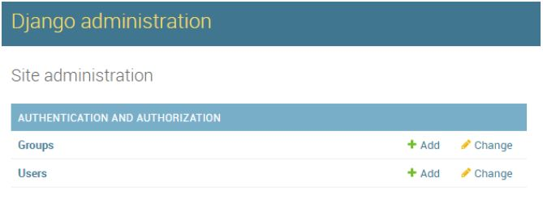
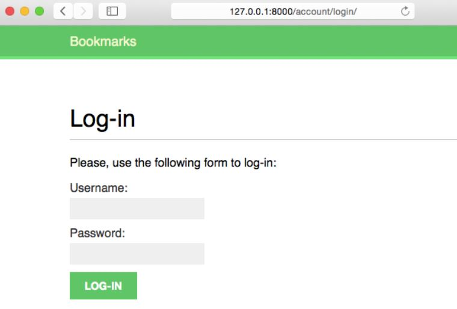
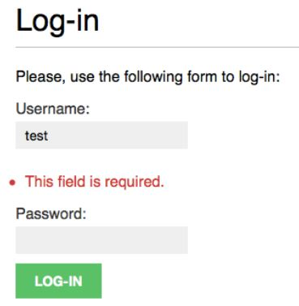
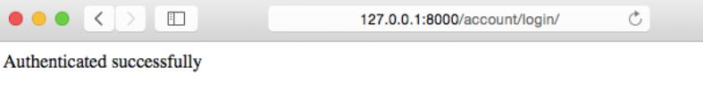

# Membuat View Login Sederhana

Buat file `account/forms.py`. Ketik kode berikut ke dalamnya:

```python
from django import forms

class LoginForm(forms.Form):
    username = forms.CharField()
    password = forms.CharField(widget=forms.PasswordInput)
```

Edit file `account/views.py` dan tambahkan kode berikut ke dalamnya:

```python
from django.http import HttpResponse
from django.shortcuts import render
from django.contrib.auth import authenticate, login
from .forms import LoginForm


def user_login(request):
    if request.method == 'POST':
        form = LoginForm(request.POST)
        
        if form.is_valid():
            cd = form.cleaned_data
            user = authenticate(username=cd['username'], password=cd['password'])
            
            if user is not None:
                if user.is_active:
                    login(request, user)
                    return HttpResponse('Authenticated successfully')
                else:
                    return HttpResponse('Disabled account')
            else:
                return HttpResponse('Invalid login')
            
    else:
        form = LoginForm()
    return render(request, 'account/login.html', {'form': form})
```

Buat file `account/urls.py` dan ketik kode berikut ke dalamnya:

```python
from django.conf.urls import url
from . import views


urlpatterns = [
	# post views
	url(r'^login/$', views.user_login, name='login'),
]
```

Edit file `bookmarks/urls.py` dan include pola URL dari aplikasi `account` sebagai berikut:

```python
from django.conf.urls import include, url
from django.contrib import admin


urlpatterns = [
	# ...
	url(r'^account/', include('account.urls')),
]
```

Buat struktur file dan folder berikut di dalam folder `account`:

```
account/
    templates/
    	account/
    		login.html
    	base.html
```

Edit file `account/templates/base.html` dan tambahkan kode berikut ke dalamnya:

```html

<!DOCTYPE html>
<html>
<head>
	<title></title>
	<link href="" rel="stylesheet">
</head>
<body>
	<div id="header">
		<span class="logo">Bookmarks</span>
	</div>
  
	<div id="content">
	
	</div>
</body>
</html>
```

Buat struktur file dan folder berikut di dalam folder `account`:

```
account/
	static/
		css/
			base.css
```

Ketik kode berikut ke dalam file `account/static/css/base.css`:

```css
@import url(http://fonts.googleapis.com/css?family=Muli);

body {
    margin:0;
    padding:0;
    font-family:helvetica, sans-serif;
}

p {
    line-height: 1.8;
}

a {
    color:#12c064;
    text-decoration:none;
}

a:hover {
    color:#00a74f;
}

h1, h2, h3, h4, h5 , h6 { font-family: 'Muli', sans-serif; font-weight:normal; }

h1 {
    border-bottom:1px solid #bbb;
    padding:0 0 10px 0;
    margin:10px 0 20px 0;
}

h2 {
    margin:30px 0 20px;
}

ol {
    line-height:1.5;
}

#header {
    padding:10px 100px;
    font-size:14px;
    background:#12c064;
    color:#fff;
    border-bottom:4px solid #1cdf78;
    overflow:auto;
}

#header .logo {
    font-family: 'Muli', sans-serif;
    float:left;
    color:#f3f7cc;
    font-size:20px;
    margin-right:10%;
}

#header ul.menu {
    list-style:none;
    float:left;
    margin:0;
    padding:0;
}
#header ul.menu li {
    float:left;
    padding:4px 10px;
}

#header ul.menu li.selected a, #header ul.menu li.selected a:hover {
    color:#1b6d32;
    font-weight:bold;
}

#header a {
    color:#f3f7cc;
}
#header a:hover {
    color:#fff;
}

#header .user {
    float:right;
    padding-top:4px;
}

#content {
    padding:30px 100px;
}

/* forms */
form {
    overflow:auto;
}

form p {
    width:100%;
    overflow:auto;
}

label {
    float:left;
    clear:both;
    color:#333;
    margin-bottom:4px;
}
input, textarea {
    clear:both;
    float:left;
    margin:0 0 10px;
    background:#efefef;
    border:0;
    padding:6px 10px;
    font-size:14px;
}
input[type=submit], a.button {
    font-weight:bold;
    background:#12c064;
    color:#fff;
    padding:10px 20px;
    font-size:14px;
    text-transform:uppercase;
}
.errorlist {
    color:#cc0033;
    float:left;
    clear:both;
    padding-left:10px;
}
.helptext {
    margin:0 0 20px 0;
    color:#aaa;
    clear:both;
    float:left;
    font-size:13px;
}
/* messages */
ul.messages {
    margin:10px 100px;
    padding:0;
    list-style-type:
    none;
}
ul.messages li.success,
ul.messages li.warning,
ul.messages li.error,
ul.messages li.info {
    margin:0;
    padding:14px 20px;
    list-style:none;
    color:#fff;
}

ul.messages li.success { background:#81ce81; }
ul.messages li.success a { color:#0ac33e; }

ul.messages li.error { background:#a30029; color:#e9828e; }
ul.messages li.error a { color:#e9828e; }

ul.messages li.info { background:#faffae; color:#696b4e; }
ul.messages li.info a { color:#1586de; }

ul.messages li.warning { background:#de9404; }
ul.messages li.warning a { color:#f49000; }

ul.messages li a.close {
    margin:0;
    float:right;
    opacity:1;
    border:0;
    box-shadow:none;
    text-shadow:none;
}

.login-form {
    float:left;
}

/* social-auth */
.social {
    float:right;
}
.social li {
    list-style:none;
    padding:10px 20px;
    margin:0 0 10px 0;
}
.social li a {
    width:100%;
    height:100%;
    display:block;
    color:#fff;
}
.social li.facebook { background:#3b5399; }
.social li.twitter { background:#00cffa; }
.social li.google { background:#de1710; }


/* images */

.image-preview, .image-detail {
    max-width:300px;
    float:left;
    margin:0 20px 20px 0;
}
.image-detail { margin-top:20px; }
.image-info div {
    padding:20px 0;
    overflow:auto;
}
.count {
    color:#aaa;
    border:3px solid #bbb;
    border-radius:26px;
    padding:10px 20px;
    margin:20px 10px 0;
}
a.like, a.follow { float:right; margin-top:-8px; }

#image-list { overflow:auto; }
#image-list .image {
    float:left;
    width:220px;
    height:300px;
    margin:0 10px 10px 10px;
    border-top:8px solid #12c064;
    background:#eee;
}
#image-list img { width:220px; height:220px; }
#image-list .info { padding:10px; }
#image-list .info a { color:#333; }
.image-likes div {
    float:left;
    width:auto;
    padding:10px;
    text-align:center;
}
.image-likes img {
    width:120px;
    height:120px;
    border-radius:50%;
}

/* users */
#people-list img {
    width:180px;
    height:180px;
    border-radius:50%;
    margin-bottom:20px;
}
#people-list .user {
    width:180px;
    float:left;
    overflow:auto;
    padding:10px;
}
#people-list .info { text-align:center; }
img.user-detail {
    border-radius:50%;
    float:left;
}
.profile-info {
    float:left;
    overflow:auto;
    margin-right:20px;
}
.image-container { margin-top:40px; }

/* actions */
.action {
    clear:both;
    overflow:auto;
}
.action .images {
    float:left;
    margin:0 10px 10px 0;
}
.action .date {
    font-style:italic;
    color:#ccc;
}
```

Sekarang buka file `account/templates/account/login.html` dan tambahkan kode berikut ke dalamnya:

```html


Log-in


<h1>Log-in</h1>
<p>Please, use the following form to log-in:</p>
<form action="." method="post">
	{{ form.as_p }}
	
	<p><input type="submit" value="Log-in"></p>
</form>

```

Buat superuser dengan perintah berikut:

```
python manage.py createsuperuser
```

Isi username, email beserta password-nya.

Jalankan server pengembangan dengan perintah berikut:

```
python manage.py runserver
```

Buka url `http://127.0.0.1:8000/admin` di browser. Kamu akan melihat tampilan seperti gambar berikut ini:



Buat `user` baru dari halaman admin.

Setelah itu akses URL `http://127.0.0.1:8000/account/login/` di browser kamu. Kamu akan melihat tapilan seperti ini:



Isi field **Username** dan kosongkan field **Password**. Maka akan muncul validasi seperti gambar berikut:



Sekarang coba isi kedua field tersebut. Jika **Username** dan **Password** valid, maka kamu akan melihat pesan seperti:



Jika tidak valid, akan muncul pesan `Invalid login`.

