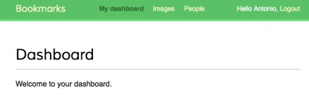
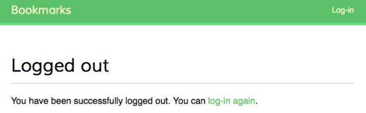

# Membuat View untuk Login dan Logout

Edit file `account/urls.py` dan buatlah menjadi seperti ini:

```python
from django.conf.urls import url
from django.contrib import auth
from . import views

urlpatterns = [
    # previous login view
    # url(r'^login/$', views.user_login, name='login'),
    
    # login / logout urls
    url(r'^login/$',
        auth.views.login,
        name='login'),
    url(r'^logout/$',
        auth.views.logout,
        name='logout'),
    url(r'^logout-then-login/$',
        auth.views.logout_then_login,
        name='logout_then_login'),
]
```

Buatlah direktori baru bernama `registration` di dalam folder `account/templates/`. Di dalam direktori `registration` buatlah file bernama `login.html` dan tambahkan kode berikut ini ke dalamnya:

```html


Log-in


<h1>Log-in</h1>

<p>
    Your username and password didn't match.
    Please try again.
</p>

<p>Please, use the following form to log-in:</p>


<div class="login-form">
    <form action="" method="post">
        {{ form.as_p }}
        
        <input type="hidden" name="next" value="{{ next }}" />
        <p><input type="submit" value="Log-in"></p>
    </form>
</div>

```

Sekarang buat lagi file template bernama `logged_out.html` dan simpan di dalam direktori `account/templates/registration/` dan buat file tersebut terlihat seperti ini:

```html


Logged out


<h1>Logged out</h1>
<p>
    You have been successfully logged out. 
    You can <a href="">log-in again</a>.
</p>

```

Buka file `account/views.py` dan tambahkan kode berikut ini ke dalamnya:

```python
from django.contrib.auth.decorators import login_required


@login_required
def dashboard(request):
    return render(request, 
                  'account/dashboard.html',
                  {'section': 'dashboard'})
```

Sekarang buatlah file template `account/templates/account/dashboard.html` dan buatlah file tersebut terlihat seperti ini:

```html


Dashboard


<h1>Dashboard</h1>
<p>Welcome to your dashboard.</p>

```

Kemudian, tambahkan pola URL untuk view yang sudah kita buat di dalam file `account/urls.py`:

```python
urlpatterns = [
    # ...
    url(r'^$', views.dashboard, name='dashboard'),
]
```

Edit file `bookmarks/settings.py` dan tambahkan kode berikut ini ke dalam file tersebut:

```python
from django.core.urlresolvers import reverse_lazy

LOGIN_REDIRECT_URL = reverse_lazy('dashboard')
LOGIN_URL = reverse_lazy('login')
LOGOUT_URL = reverse_lazy('logout')
```

Edit file `account/templates/base.html` dan modifikasi element `<div>` yang memiliki ID `header` menjadi seperti ini:

```html
<div id="header">
    <span class="logo">Bookmarks</span>
    
    
    <ul class="menu">
        <li class="selected">
            <a href="">My dashboard</a>
        </li>
        <li class="selected">
            <a href="#">Images</a>
        </li>
        <li class="selected">
            <a href="#">People</a>
        </li>
    </ul>
    
    <span class="user">
        
        Hello {{ request.user.first_name }},
        <a href="">Logout</a>
        
        <a href="">Log-in</a>
        
    </span>
</div>
```

Sekarang, akses URL `http://127.0.0.1:8000/account/login/` di browser kamu. Akan muncul halaman login. Lakukan login.

ketika login berhasil, kamu akan di bawa ke halaman dashboard seperti pada gambar di bawah ini:



Klik link **Logout** untuk keluar. Akan tampil halaman seperti gambar berikut ini:




