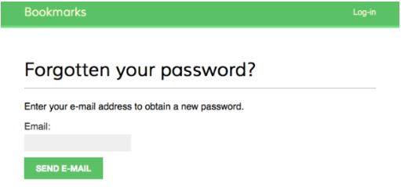
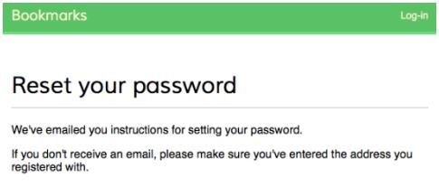
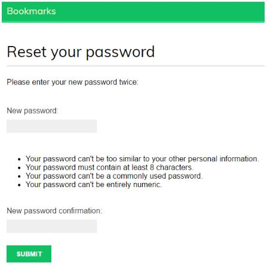
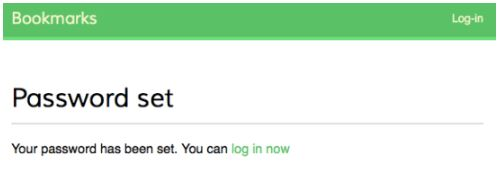

# Membuat View untuk Mereset Password

Tambahkan URL pattern berikut untuk mereset password ke dalam file `account/urls.py`:

```python
# restore password urls
url(r'^password-reset/$', 
    auth.views.password_reset,
    name='password_reset'),
url(r'^password-reset/done/$', 
    auth.views.password_reset_done,
    name='password_reset_done'),
url(r'^password-reset/confirm/(?P<uidb64>[-\w]+)/'\
    '(?P<token>[-\w]+)/$',
    auth.views.password_reset_confirm,
    name='password_reset_confirm'),
url(r'^password-reset/complete/$',
    auth.views.password_reset_complete,
    name='password_reset_complete'),
```

Buat file baru bernama `password_reset_form.html` di dalam direktori `account/templates/registration/` dan tambahkan kode berikut ini ke dalamnya:

```html


Reset your password


<h1>Forgotten your password?</h1>
<p>Enter your e-mail address to obtain a new password.</p>
<form action="." method="post">
    {{ form.as_p }}
    <p><input type="submit" name="Send e-mail"></p>
    
</form>

```

Sekarang, buat file lain di dalam direktori yang sama dengan nama `password_reset_email.html`. Tambahkan kode berikut ini ke dalamnya:

```html
Someone asked for password reset for email {{ email }}. Follow the
link below:
{{ protocol }}://{{ domain }}
Your username, in case you've forgotten: {{ user.get_username }}
```

Buat file lain di dalam direktori yang sama dengan nama `password_reset_done.html`. Tambahkan kode berikut ini ke dalamnya:

```html


Reset your password


<h1>Reset your password</h1>
<p>
    We've emailed you instructions for 
    setting your password.
</p>
<p>
    If you don't receive an email, please
    make sure you've entered the address you
    registered with.
</p>

```

Buat file template lain dengan nama `password_reset_confirm.html` di dalam direktori yang sama. Tambahkan kode berikut ini ke dalamnya:

```html


Reset your password


<h1>Reset your password</h1>


<p>Please enter your new password twice:</p>
<form action="." method="post">
    {{ form.as_p }}
    
    <p><input type="submit" name="Change my password"></p>
</form>

<p>
    The password reset link was invalid, possibly because
    it has already been used. Please request a new password
    reset.
</p>



```

Buat file template lain dengan nama `password_reset_complete.html` di dalam direktori yang sama. Tambahkan kode berikut ini ke dalamnya:

```html


Password reset


<h1>Password set</h1>
<p>
    Your password has been set. 
    You can <a href="">Log in now</a>
</p>

```

Terakhir, edit file template `account/templates/registration/login.html` dan tambahkan kode berikut setelah element <form>:

```html
<p>
    <a href="">
        Forgotten your password?
    </a>
</p>
```

Sekarang buka http://127.0.0.1:8000/account/login/ di browser kamu dan klik link `Forgotten your password?`. Kamu harus melihat halaman seperti ini:




Edit file `settings.py` dari direktori project Kamu dan tambahkan baris berikut ini ke dalamnya:

```python
EMAIL_BACKEND = 'django.core.mail.backends.console.EmailBackend'
```

Kembali ke browser, masukan email address user dan klik tombol `Send e-mail`. Kamu harus melihat halaman seperti ini:



Lihat kembali console tempat Kamu menjalankan server pengembangan. Kamu akan melihat kiriman e-mail sebagai berikut:

```txt
IME-Version: 1.0
Content-Type: text/plain; charset="utf-8"
Content-Transfer-Encoding: 7bit
Subject: Password reset on 127.0.0.1:8000
From: webmaster@localhost
To: user@domain.com
Date: Thu, 24 Sep 2015 14:35:08 -0000
Message-ID: <20150924143508.62996.55653@zenx.local>


Someone asked for password reset for email user@domain.com. Follow the
link below: 
http://127.0.0.1:8000/account/password-reset/confirm/MQ/45f-9c3f30caafd523055fcc/
Your username, in case you've forgotten: admin
```

Buka URL pada `link below` di browser Kamu. Kamu harus melihat halaman seperti ini:



Isi password baru dan isi password confirmation dan klik tombol `Change my password`. Kamu akan melihat halaman sukses seperti ini:




