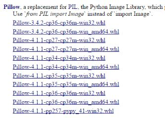
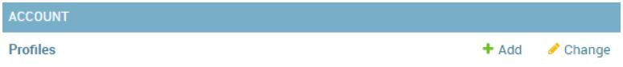
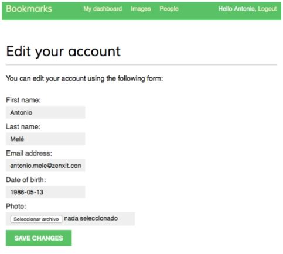

# Mengextends Model User

Edit file `account/models.p`y dan tambahkan kode berikut ke dalamnya:

```python
from django.db import models
from django.conf import settings


class Profile(models.Model):
    user = models.OneToOneField(settings.AUTH_USER_MODEL)
    date_of_birth = models.DateField(blank=True, null=True)
    photo = models.ImageField(upload_to='users/%Y/%m/%d',
                              blank=True)
    
    def __str__(self):
        return 'Profile for user {}'.format(self.user.username)
```

Install `Pillow` dengan menjalankan perintah berikut pada command line Kamu:

```txt
pip install Pillow==2.9.0
```

**Windows 10, Python 36 dan Pillow 4.1.0**

Bagi yang mengalami error seperti ini:

```txt
...
building 'PIL._imaging' extension
error: Microsoft Visual C++ 14.0 is required. Get it with "Microsoft Visual C++ Build Tools": http://landinghub.visualstudio.com/visual-cpp-build-tools 
...
```

Upgrade package `setuptools` untuk versi `34.x` keatas, versi saat catatan ini ditulis adalah versi `36.x`:

```txt
pip install --upgrade setuptools
```

Download package Pillow whl di link berikut ini:

```txt
http://www.lfd.uci.edu/~gohlke/pythonlibs/#pillow
```

Catatan ini menggunakan `Python 3.6 64-bit`, pilih sesuai arsitektur komputer dan versi Python Kamu. Di sini saya memilih `Pillow-4.1.1-cp36-cp36m-win_amd64.whl`:



Jalankan perintah berikut untuk menginstal package `Pillow` dari file `whl`:

```txt
pip install Pillow-4.1.1-cp36-cp36m-win_amd64.whl
```

Selanjutnya, tambahkan pengaturan berikut ke file `bookmarks/settings.py`:

```python
MEDIA_URL = '/media/'
MEDIA_ROOT = os.path.join(BASE_DIR, 'media/')
```

Sekarang edit file `bookmarks/urls.py` dan ubah kodenya menjadi seperti ini:

```python
# ...
from django.conf import settings
from django.conf.urls.static import static


urlpatterns = [
    # ...
]

if settings.DEBUG:
    urlpatterns += static(settings.MEDIA_URL, 
                          document_root=settings.MEDIA_ROOT)
```

Buka command line kembali dan jalankan perintah berikut untuk membuat migrasi database untuk model `Profile` dari aplikasi `account` Kamu:

```txt
python manage.py makemigrations
```

Kamu akan melihat output seperti ini:

```txt
Migrations for 'account':
    account\migrations\0001_initial.py
    - Create model Profile
```

Selanjutnya, sinkronkan database dengan perintah berikut ini:

```txt
python manage.py migrate
```

Kamu akan melihat output yang berisi baris berikut ini:

```txt
Running migrations:
    Applying account.0001_initial... OK
```

Edit file `account/admin.py` dan register model `Profile` ke dalam situs admin, seperti ini:

```python
from django.contrib import admin
from .models import Profile


class ProfileAdmin(admin.ModelAdmin):
    list_display = ['user', 'date_of_birth', 'photo']


admin.site.register(Profile, ProfileAdmin)
```

Jalankan server pengembangan lagi menggunakan perintah `python manage.py runserver`. Buka situs admin dan Kamu harus melihat bahwa model `Profile` sudah ada di situs admin seperti gambar berikut ini:



Tambahkan form model berikut di dalam file `account/forms.py`:

```python
from .models import Profile


class UserEditForm(forms.ModelForm):
    class Meta:
        model = User
        fields = ('first_name', 'last_name', 'email')


class ProfileEditForm(forms.ModelForm):
    class Meta:
        model = Profile 
        fields = ('date_of_birth', 'photo')
```

Edit file `account/views.py` dan import model `Profile` seperti ini:

```python
from .models import Profile
```

Dan tambahkan baris berikut ke dalam view `register` di bawah `new_user.save()`:

```python
# Create the user profile
profile = Profile.objects.create(user=new_user)
```

Tambahkan kode berikut ini ke dalam file yang sama:

```python
from .forms import LoginForm, UserRegistrationForm, \
                   UserEditForm, ProfileEditForm
                   
@login_required
def edit(request):
    if request.method == 'POST':
        user_form = UserEditForm(instance=request.user,
                                 data=request.POST)
        profile_form = ProfileEditForm(
                            instance=request.user.profile,
                            data=request.POST,
                            files=request.FILES)
    
    	if user_form.is_valid() and profile_form.is_valid():
            user_form.save()
            profile_form.save()
    else:
        user_form = UserEditForm(instance=request.user)
        profile_form = ProfileEditForm(
                            instance=request.user.profile)
    
    return render(request,
                  'account/edit.html',
                  {'user_form': user_form,
                  'profile_form': profile_form})
```

Tambahkan pola URL berikut ke dalam file `account/urls.py`:

```python
url(r'^edit/$', views.edit, name='edit'),
```

Terakhir, buat file template untuk view tersebut di dalam folder `account/templates/account` dengan nama `edit.html`. Tambahkan kode berikut ini:

```html


Edit your account


<h1>Edit your account</h1>
<p>You can edit your account using the following form:</p>
<form action="." method="post" enctype="multipart/form-data">
    {{ user_form.as_p }}
    {{ profile_form.as_p }}
    
    <p><input type="submit" name="Save changes"></p>
</form>

```

Register user baru dan buka `http://127.0.0.1:8000/account/edit/`. Kamu harus melihat halaman seperti gambar berikut ini:



Buka file template `account/templates/account/dashboard.html` timpa baris berikut ini:

```html
<p>Welcome to your dashboard.</p>
```

Dengan baris berikut ini:

```html
<p>
    Welcome to your dashboard.
    You can <a href="">edit your profile</a>
    or <a href="">change your password</a>.
</p>
```


