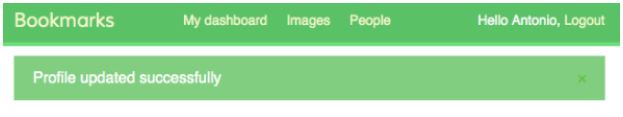
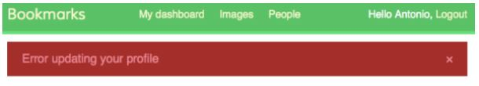

# Menggunakan Messages Flash Django

Buka kembali file template `account/templates/base.html` dan tambahkan kode berikut diantara elemen `<div>` yang memiliki atribut `id='header'` dan elemen `<div>` yang memiliki atribut `id='content'`:

```html

<ul class="messages">

    <li class="{{ message.tags }}">
        {{ message|safe }}
        <a href="#" class="close">x</a>
    </li>

</ul>

```

Sekarang, modifikasi view edit yang ada di dalam direktori `account/views.py` dan buat view `edit` menjadi seperti ini:

```python
from django.contrib import messages

@login_required
def edit(request):
    if request.method == 'POST':
        # ... 

        if user_form.is_valid() and profile_form.is_valid():
            user_form.save()
            profile_form.save()
            messages.success(request, 'Profile updated '\
                             'successfully')
        else:
            messages.error(request, 
                           'Error updating your profile')
    else:
        # ...
    # ...
```

Buka `http://127.0.0.1:8000/account/edit/` di browser Anda dan edit-lah profile Anda. Ketika profile berhasil di update, Anda harus melihat pesan seperti berikut ini:



Ketika form tidak valid, Anda harus melihat pesan seperti gambar berikut ini:



