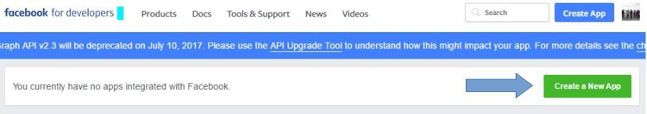
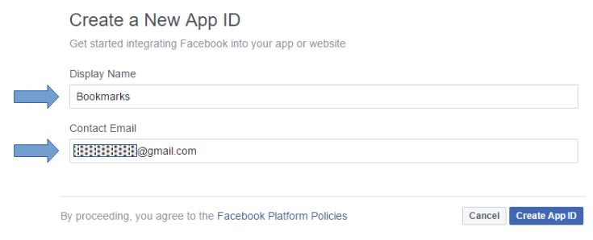
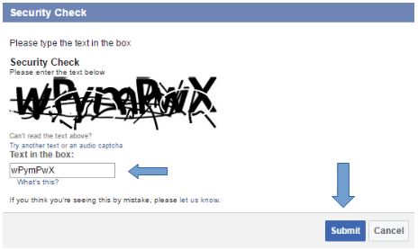
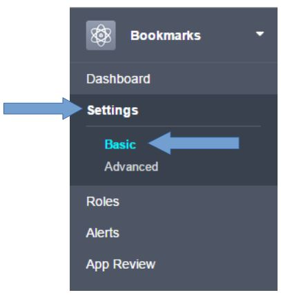
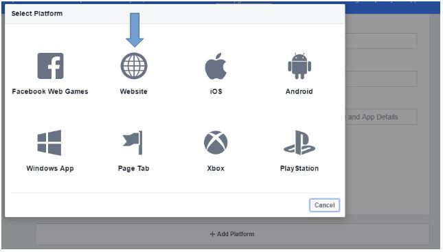
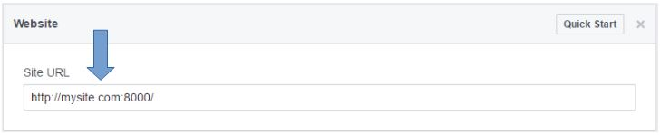
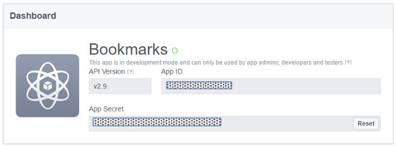
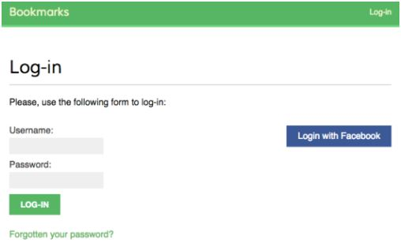
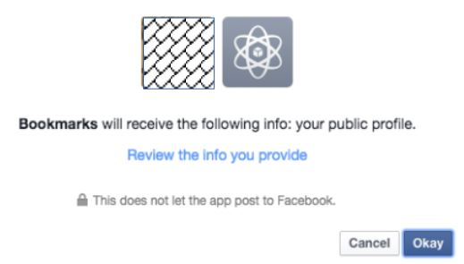

# Social Authentication dengan Facebook

Tambahkan baris berikut ke pengaturan `AUTHENTICATION_BACKENDS` di dalam file `bookmarks/settings.py`:

```python
AUTHENTICATION_BACKENDS = (
    'social_core.backends.facebook.FacebookOAuth2',
    # ...
)
```

Login ke facebook, lalu akses URL berikut ini:

https://developers.facebook.com/apps/?action=create 

Klik tombol `Create a New App`:



Isi `Display Name` dan `Contact Email`. Klik tombol `Create App ID` seperti pada gambar berikut ini:



Isi captcha `security check` dan klik tombol `Submit`:



Setelah itu, klik menu `Settings` di samping kiri lalu klik `Basic`. 



Scroll ke bawah, klik `+ Add Platform` untuk menambahkan `platform` dan pilih `Website`:



Masukan `http://mysite.com:8000/` di field `Site URL` dan klik tombol `Save Changes` di pojok kanan bawah:



Buka `Dashboard` dan Kamu akan melihat sesuatu seperti gambar berikut ini:



Copy `App ID` dan `App Secret` dan tambahkan ke dalam file `bookmarks/settings.py` seperti berikut ini:

```python
SOCIAL_AUTH_FACEBOOK_KEY = 'XXX' # Facebook App ID
SOCIAL_AUTH_FACEBOOK_SECRET = 'XXX' # Facebook App Secret
```

Opsi lain, Kamu bisa mendefinisikan pengaturan `SOCIAL_AUTH_FACEBOOK_SCOPE` dengan permission tambahan yang akan ditanyakan kepada user Facebook, sehingga bentuknya menjadi:

```python
SOCIAL_AUTH_FACEBOOK_KEY = 'XXX' # Facebook App ID
SOCIAL_AUTH_FACEBOOK_SECRET = 'XXX' # Facebook App Secret
SOCIAL_AUTH_FACEBOOK_SCOPE = ['email']
```

Terakhir, buka file template `account/templates/registration/login.html` dan sisipkan kode berikut ke dalam block `content`:

```html
<div class="social">
    <ul>
        <li class="facebook">
            <a href="">
                Sign in with Facebook
            </a>
        </li>
    </ul>
</div>
```

Buka `http://mysite.com:8000/account/login/` di browser Kamu. Sekarang halaman login Kamu terlihat seperti berikut:



Klik tombol `Login with Facebook`. Kamu akan dibawa ke Facebook dan Kamu akan meilhat modal dialog seperti pada gambar di bawah ini:




