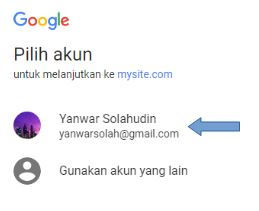

# Social Authentication dengan Google

Tambahkan baris berikut:

* `social_core.backends.google.GoogleOpenId`
* `social_core.backends.google.GoogleOAuth2`
* `social_core.backends.google.GoogleOAuth`

ke pengaturan `AUTHENTICATION_BACKENDS` di dalam file `bookmarks/settings.py`:

```python
AUTHENTICATION_BACKENDS = (
    # ...
    'social_core.backends.google.GoogleOpenId',
    'social_core.backends.google.GoogleOAuth2',
    'social_core.backends.google.GoogleOAuth',
    # ...
)
```

Buka `Google Developer Console` di URL https://console.developers.google.com/project. Klik link `CREATE PROJECT`.


Isi dengan `Project name` dengan `Bookmarks` dan klik tombol `Create`.


Jangan lupa untuk memilih project `Bookmarks` di bagian atas:


Setelah project dibuat, buka menu di sebelah kiri. Pilih link `API Manager` dan klik menu `Credentials`:


Klik tombol `Add credentials` dan pilih `Oauth client ID` (atau `Oauth 2.0 client ID`) sebagai berikut:


Klik tombol `Configure consent screen`:


Akan muncul form `OAuth consent screen` seperti pada gambar berikut. Pilih `Email addreses` sesuai email Anda saat ini. Isi `Product name shown to users` dengan `Bookmarks App` dan isi `Privacy policy URL` dengan `http://mysite.com:8000/`. Klik tombol `Save`.


Selanjutnya pilih `Application type` dengan `Web application`. Pada field `Name` masukan `Bookmarks`. Pada `Authorized redirect URIs` masukan `http://mysite.com:8000/social-auth/complete/google-oauth2/`.  Klik tombol `Create`.


Akan muncul dialog modal yang berisi `OAuth client` yang sudah Anda buat. Copy `client ID` dan `client secret`. 


Tambahkan `client ID` dan `client secret` dan ke dalam file `bookmarks/settings.py`, seperti ini:

```python
SOCIAL_AUTH_GOOGLE_OAUTH2_KEY = 'xxx' # Google Consumer Key
SOCIAL_AUTH_GOOGLE_OAUTH2_SECRET = 'xxx' # Google Consumer Secret
```

Klik menu `Dashboard` di sebelah kiri.


Klik link `ENABLED API`:


Pilih `Social Api`, lalu klik link `Google+ API`:


Selanjutnya klik link `ENABLE`:


Sekarang, edit file template `account/templates/registration/login.html` dan tambahkan kode berikut di dalam element `<ul>`:

```python
<li class="google">
    <a href="">
        Login with Google
    </a>
</li>
```

Buka http://mysite.com:8000/account/login/ di browser Anda. Halaman login harus terlihat seperti:


Klik tombol `Login with Google`. Anda akan di bawah ke halaman Pilih akun. Pilih akun Anda untuk melanjutkan ke `mysite.com`:



Selanjutnya akan muncul halaman seperti berikut ini. Klik tombol `Accept`:


Anda akan di bawa kembali ke halaman Dashboard pada aplikasi `bookmarks`.


