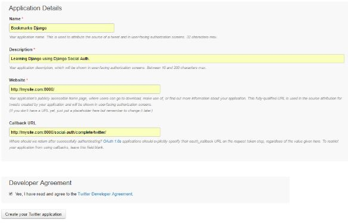
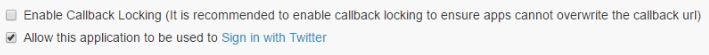
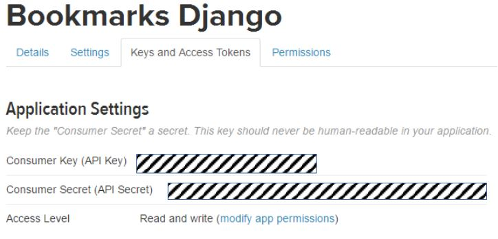
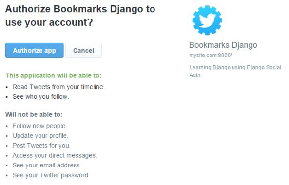

# Social Authentication dengan Twitter

Tambahkan `social_core.backends.twitter.TwitterOAuth` berikut ke pengaturan `AUTHENTICATION_BACKENDS` di dalam file `bookmarks/settings.py`:

```python
AUTHENTICATION_BACKENDS = (
    # ...
    'social_core.backends.twitter.TwitterOAuth', 
    # ...
)
```

Buka URL https://apps.twitter.com/app/new untuk membuat application Twitter:



Isi field-field berikut:

* `Name`: Bookmarks Django.
* `Description`: Terserah kamu.
* `Website`: http://mysite.com:8000/.
* `Callback URL`: http://mysite.com:8000/social-auth/complete/twitter/.
* `Developer Agreement`: Ceklis.

Klik tombol `Create your Twitter application`. Kamu akan di bawa ke halaman Dashboard application Twitter. Klik tab `Settings`, ceklis pada bagian `Allow this application to be used to Sign in with Twitter`:



Selanjutnya, klik tab Keys and Access Tokens. Kamu akan melihat halaman seperti ini:



Copy `Consumer Key` dan `Consumer Secret` ke dalam pengaturan social auth di dalam file `bookmarks/settings.py` menjadi seperti berikut ini:

```python
SOCIAL_AUTH_TWITTER_KEY = 'XXX' # Twitter Consumer Key
SOCIAL_AUTH_TWITTER_SECRET = 'XXX' # Twitter Consumer Secret
```

Sekarang, edit file template `account/templates/registration/login.html` dan tambahkan kode berikut di dalam element `<ul>`:

```html
<li class="twitter">
    <a href="">
        Login with Twitter
    </a>
</li>
```

Buka http://mysite.com:8000/account/login/ di browser Kamu dan klik link `Login with Twitter`. Kamu akan dibawa ke halaman `Authorize Twitter` untuk aplikasi `Bookmarks Django` seperti gambar berikut ini:



Klik tombol `Authorize app`. Kamu akan dibawa kembali ke halaman Dashboard aplikasi bookmarks dengan status sudah login.
