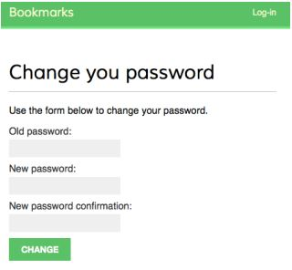
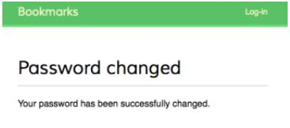

# Membuat View untuk Mengubah Password

Buka file `account/urls.py` dan tambahkan pola URL berikut ini:

```python
# change password urls
url(r'^password-change/$', 
    auth.views.password_change,
    name='password_change'),
url(r'^password-change/done/$',
    auth.views.password_change_done,
    name='password_change_done'),
```

Tambahkan file template baru di dalam direktori `account/templates/registration` dengan nama `password_change_form.html`. Tambahkan kode berikut ini:

```html


Change you password


<h1>Change you password</h1>
<p>Use the form below to change your password.</p>
<form action="." method="post">
    {{ form.as_p }}
    <p><input type="submit" value="Change"></p>
    
</form>

```

Sekarang, buat file lain bernama `password_change_done.html` di direktori yang sama. Tambahkan kode berikut ini:

```html


Password changed


<h1>Password changed</h1>
<p>Your password has been successfully changed.</p>

```

Buka `http://127.0.0.1:8000/account/password-change/` di browser. Kamu harus ber-status login. Kamu akan melihat halaman untuk mengubah password seperti ini:



Isi form dengan password Kamu saat ini dan password Kamu yang baru dan klik tombol `Change`. Kamu akan melihat halaman sukses seperti ini:



Logout dan login kembali dengan password baru Kamu.


